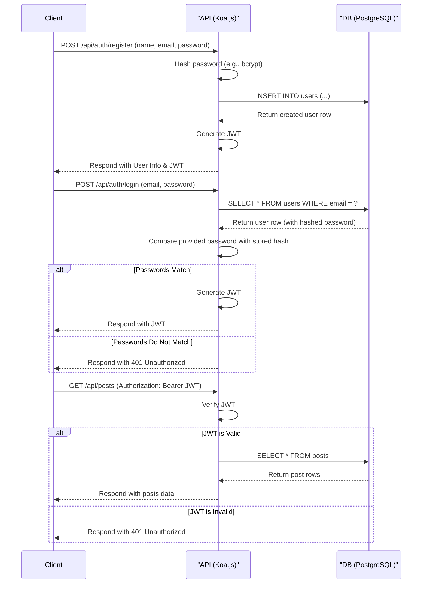

<h2 align="center">📑 SimpleBlog CMS</h2>
<p align="center">SimpleBlog CMS is a headless Content Management System (CMS) for a simple blog application. It provides a RESTful API for managing users, posts, and comments.</p>
<div align="center">
  


</div>

## Features
- User Authentication: Secure user registration and login using JSON Web Tokens (JWT).
- Post Management: Full CRUD (Create, Read, Update, Delete) functionality for blog posts.
- Comment System: Users can add comments and replies to posts. Full CRUD on comments is also supported.
- Markdown to HTML: Automatically converts post content from Markdown to HTML.
- Password Hashing: Securely hashes user passwords before storing them in the database.
- Environment-based Configuration: Easy setup using environment variables.

## Tech Stack
- Backend: Node.js, Koa.js
- Database: PostgreSQL with Sequelize ORM
- Language: TypeScript
- Authentication: JSON Web Tokens (JWT), bcrypt.js for hashing
- Content: `marked` for Markdown to HTML conversion and `DomPurify` for converted HTML sanitization.
- Emailing: `nodemailer` for sending emails (email verification, password resets).

## Structure
```
/src
├── /config        # Environment variables and configuration
├── /controllers   # Request handlers and business logic
├── /middleware    # Koa middleware (e.g., auth)
├── /models        # Sequelize schemas and models
├── /routes        # API route definitions
├── /utils         # Utility functions
└── app.ts         # Application entry point
```

## System Architecture Overview


## Getting Started
Follow these instructions to get a copy of the project up and running on your local machine for development and testing purposes.
#### Prerequisites
- Node.js (v20+ recommended)
- PostgreSQL is installed and running.

#### Installation
1. Clone the repository:
```
git clone https://github.com/ujarhr/simpleblog-cms.git
cd simpleblog-cms
```
2. Install dependencies:
```
pnpm install
```
3. Set up environment variables:
Create a `.env` file in the root of the project by copying the example file:
```
cp .env.example .env
```
4. Now, open the `.env` file and fill in the required values:
```
ENV=development
PORT=3000
JWT_SECRET=A_Long_Random_Secret

# Project Info
PROJECT_NAME=SimpleBlog CMS
PROJECT_EMAIL=hello@rhraju.com

# Database Configurations
DB_TYPE=postgres
DB_HOST=127.0.0.1
DB_PORT=5432
DB_USER=root
DB_PASS=password
DB_NAME=simpleblog

# SMTP Configurations
SMTP_HOST=smtp.ethereal.email
SMTP_PORT=587
SMTP_USER=demo@ethereal.email
SMTP_PASS=Your_Ethereal_Password
```

5. Running the Application:
```
pnpm run dev
```

#### Overall Project Details -> [Markdown Note-taking App](https://roadmap.sh/projects/markdown-note-taking-app)
## License
This project is licensed under the MIT License - see the LICENSE file for details.
